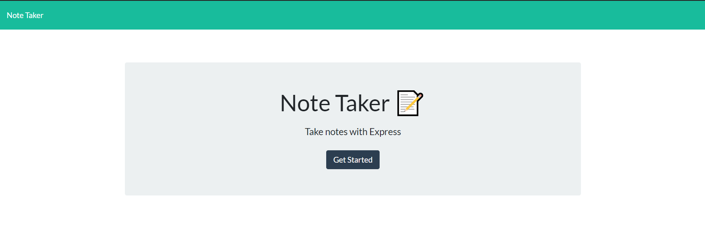
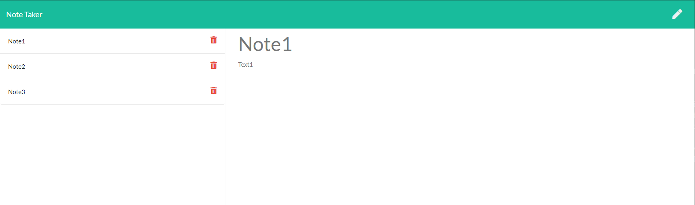

# mas-note-taker
Note Taking App

This app will allow you to take notes and save them to a database. It uses the heroku server to make this persistant.

Users are first presented with this page.

After clicking the get started button they are taken to the notes page.

## Instructions

1. The user is presented with a home page.
2. The user clicks the begin button and is taken to the notes page.
3. The user writes a note title and note content and clicks the save icon.
4. The note is saved to a list on the left side.
5. The user can click on the notes to see what the content is.

## Built With

* [VSCode](https://code.visualstudio.com/) - Code editing software
* [GitBash](https://gitforwindows.org/) - Command line interface
* [node.js](https://nodejs.org/en/) - Node.js® is a JavaScript runtime built on Chrome's V8 JavaScript engine.
* [heroku](www.heroku.com) - Heroku is a cloud platform as a service supporting several programming languages.

## Authors

* **Mitch Schimmoeller** - *Programmer* - [Schimmoellerm](https://github.com/Schimmoellerm)

## Acknowledgments

* The OSU coding boot camp, its Instructor and TAs who fielded questions regarding this assignment.
* My fellow classmates for providing thoughts and ideas on how to get things working how id like.